# First Street Foundation API Access Documentation (Python)
[](https://circleci.com/gh/FirstStreet/fsf_api_access_python)


The First Street Foundation API Access (Python) is a wrapper used to bulk extract flood data from the First Street Foundation API


### Current Release:
Current release: 0.1

**Notice:** This API wrapper is subject to change.

# Table of contents
- **[Installation](#installation)**
  * [Running the Project - Method 1: Through the Command Line](#method1)
    + [Command Line Argument Details](#commandline)
  * [Running the Project - Method 2: Through the Client](#method2)
      - [Client Initialization Details](#client-init)
      - [Arguments](#client-#arguments)
- **[Products](#products)**
  - [Location](#location)
  - [Probability](#probability)
  - [Historic](#historic)
  - [Adaptation](#adaptation)
  - [Fema](#fema)
  - [Environmental](#environmental)
- **[Examples](#examples)**
- **[CSV File Output:](#csv-output)**
  - [CSV File Name:](#csv-name)
  - [CSV File Content](#csv-content)
- **[Updating the Project to the Newest Version:](#updating)**
- **[License](#license)**

<a name="installation"></a>
# Installation
**NOTE**: This project requires [Python](https://www.python.org/downloads/) 3.6+ to run.
1. Go to the Python page (https://www.python.org/downloads/) and download then install Python version 3. **Make sure that the checkbox is checked for Python to be added to the PATH**

    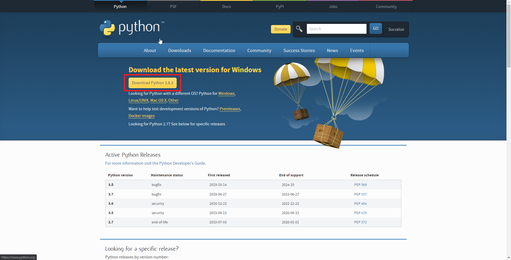
    
    
    
    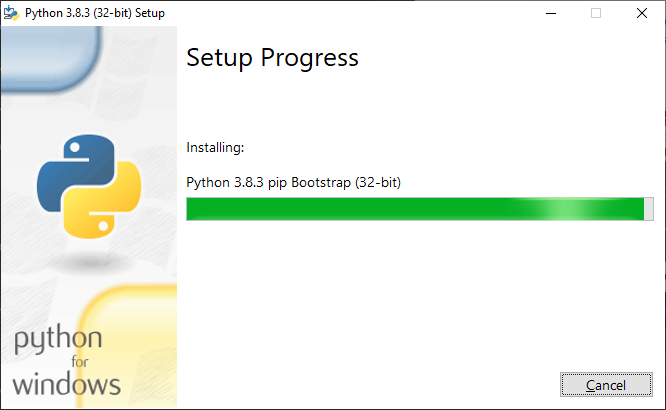
    
    
    
2. Install the source code manager [Git]

    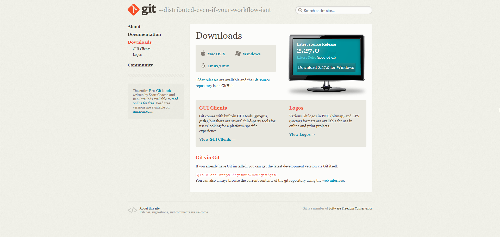
    
3. Open `git bash` and create then navigate to a new project directory

    ```sh
    mkdir fsf_api
    cd fsf_api
    ```
   
    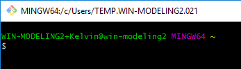
    
    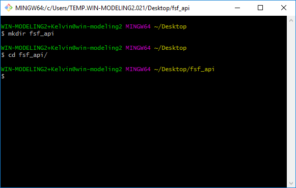
    
4. Clone the project repository (https://github.com/FirstStreet/fsf_api_access_python.git) to the new directory
    ```sh
    Example File Structure:
    
    .
    ├── fsf_api_access_python
    ```
    
    ```sh
    git clone https://github.com/FirstStreet/fsf_api_access_python.git
    ```
   
    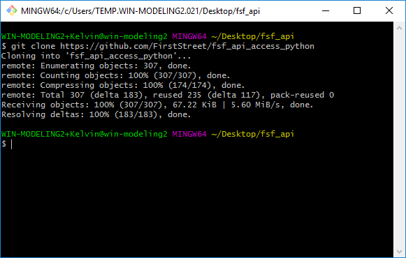

5. [Optional] Open a new console or close and re-open a console and create and activate a new virtual environment in the project directory:
    ```sh
    python -m venv /path/to/new/virtual/environment
   
    cd /path/to/project
   
    .\venv\Scripts\activate
    ```
    
    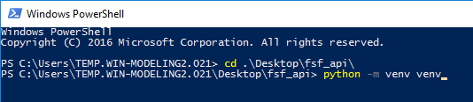
    
    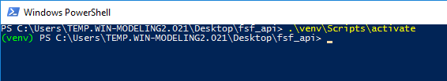
    
6. Run the setup script to install the project requirements
    ```sh
    cd /path/to/project
   
    pip install .\fsf_api_access_python\.
    ```
    
    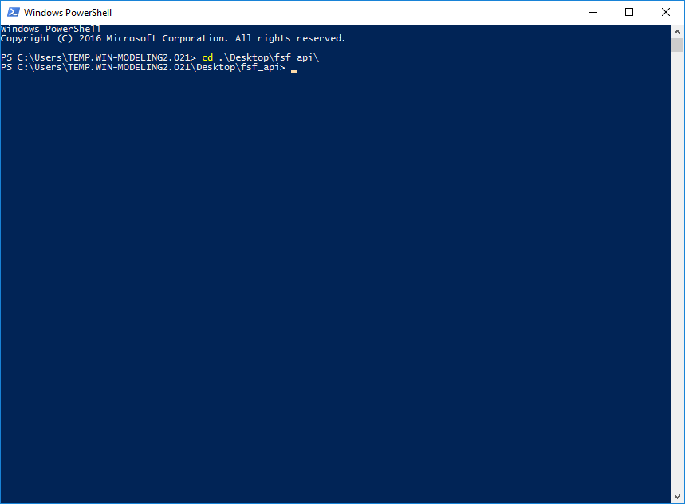
    
    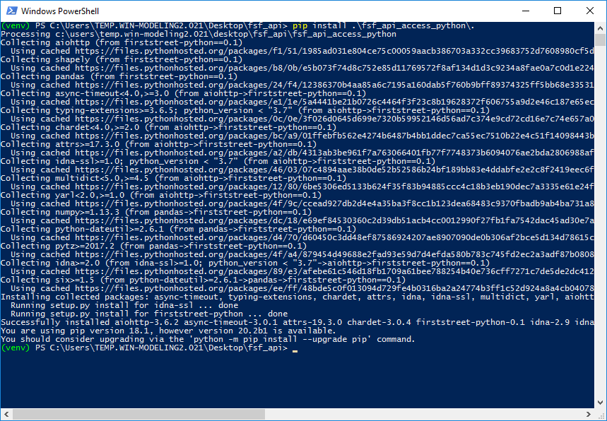
    
7. The project is now setup and can be ran through one of the two methods below. See `Products` for additional details on how to extract flood data products from the API.
    ```sh
    Example File Structure:
    
    .
    ├── fsf_api_access_python.
    ├── venv
    ├── my_script.py

<a name="method1"></a>
## Running the Project - Method 1: Through the Command Line
**[Reminder] Keep your API key safe, and do not share it with others!**

1. [Required] Set an Environmental Variable with the `variable_name` as `FSF_API_KEY` and the `variable_value` with the `API_KEY`.
    
    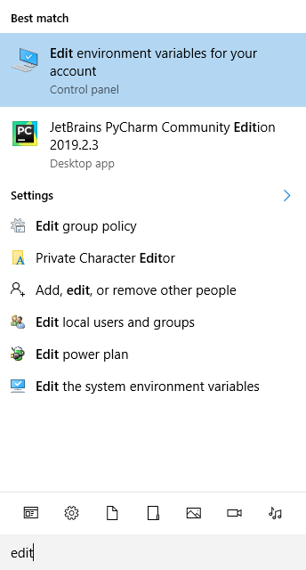
    
    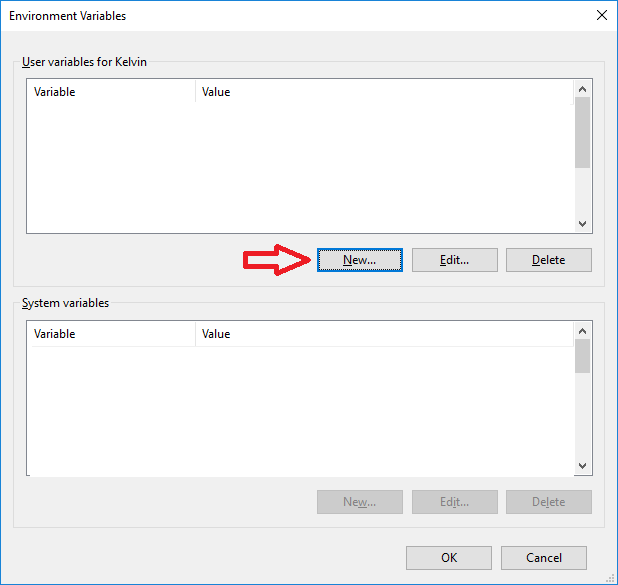
    
    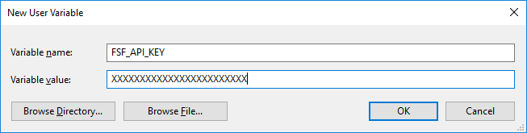

2. Open a new console and navigate to the project directory. Next, call one of the methods described below in the `Products` section through the command line. See the `Examples` section for more examples.
    ```sh
    cd /path/to/project
    python -m firststreet -p <product>.<product_subtype> -i <fsids> -f <file_name> -l <lookup_type>
    ```
    
    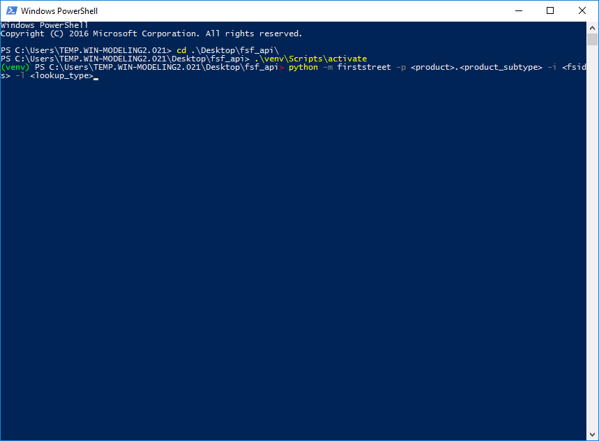
    
<a name="commandline"></a>
### Command Line Argument Details:

- `-p/--product PRODUCT`: [REQUIRED] The product to call from the API

    Example: ```-p location.get_detail```
    
- `[-api_key/--api_key API_KEY]`: [OPTIONAL] If step 1 is skipped or unavailable, this argument can take the `API_KEY` instead.

    Example: ```-a XXXXXXXXXXXXXXXXXXX```
    
- `[-v/--version VERSION]`: [OPTIONAL] The version of the API to call. Defaults to the current version.

    Example: ```-v v1```
    
- `[-i/--fsids FSIDS]`: [OPTIONAL] The FSIDs to search for with the product

    Example: ```-i 541114211,541229206```
    
- `[-l/--location LOOKUP_TYPE]`: [OPTIONAL] The lookup location type (property, neighborhood, city, zcta, tract, county, cd, state)

    Example: ```-l property```
    
- `[-limit/--limit LIMIT]`: [OPTIONAL] The max number of connections to make the the API at the same time. Defaults to 100 connections

    Example: ```-limit 20```
    
- `[-log/--log LOG]`: [OPTIONAL] To log info output to the console or not. Defaults to True

    Example: ```-l False```
    
- `[-f/--file FILE]`: [OPTIONAL] A file of FSIDs (one per line) to search for with the product

    Example: ```-f sample.txt```

    Content of a sample text file. Note that the file must be in the same directory as the project:
    ```text
    541114211
    540456284
    541229206
    540563324
    541262690
    540651172
    ```
  
    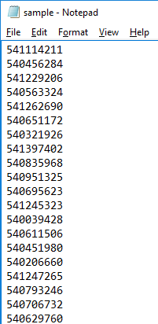
    
    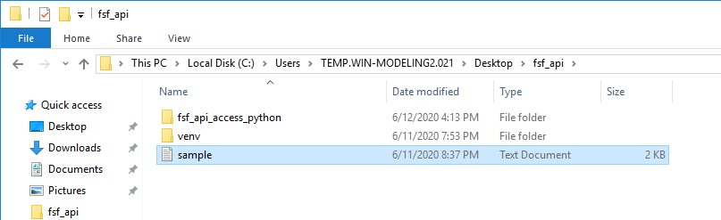

<a name="method2"></a>
## Running the Project - Method 2: Through the Client
**[Reminder] Keep your API key safe, and do not share it with others!**

1. Create a new Python script (by using notepad or any other text editor) and initialize a First Street Foundation API Client. 
    ```python
    # Contents of my_script.py
    import firststreet
    fs = firststreet.FirstStreet("api-key")
    ```
    <a name="client-init"></a>
    #### Client Initialization Details
    
    ```python
    firststreet.FirstStreet(api_key, [version], [log])
    ```
    
    <a name="client-arguments"></a>
    #### Arguments
    * api_key `string`: The assigned API key to access the API.
    * version `string= v1`: The version of the API to access. Defaults to the current version.
    * log `bool= True`: Setting for whether to log info or not. Defaults to True.

2. Call one of the methods described below in the `Products` section with the required arguments. See the `Examples` section for more examples.
    ```python
    fs.<product>.<product_subtype>(<fsids: list>, <lookup_type: string>, <csv: boolean>)
    ```
    
    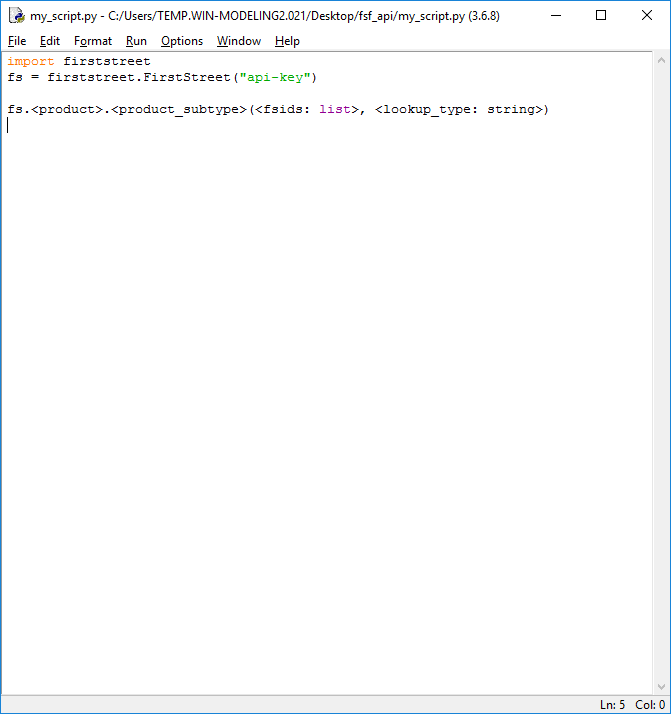
    
    OR
    
    
    
    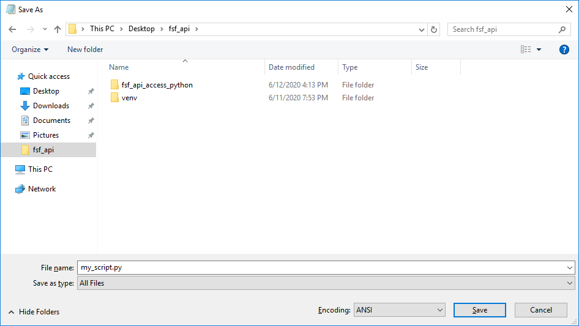
    
3. Run the python script.

    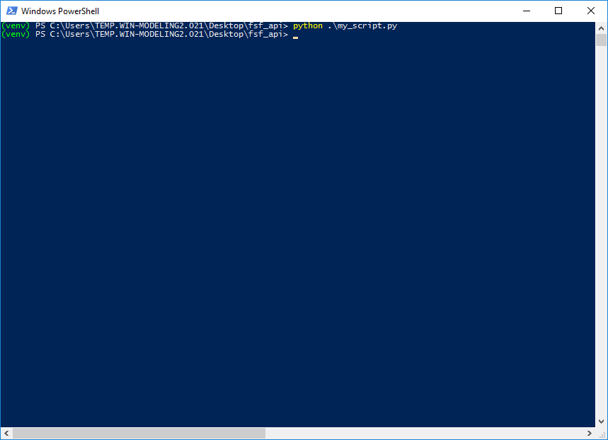

<a name="products"></a>
# Products
<a name="location"></a>
#### Location

The Location API provides `Detail` and `Summary` data for the given FSIDs.

```python
location.<method>
```

* `get_detail`(fsids `list`, location_type `string`, csv `bool`, [core_limit `int=100`]) - Returns an array of `Location Detail` product for the given IDs, location_type, and optionally creates a csv file
* `get_summary`(fsids `list`, location_type `string`, csv `bool`, [core_limit `int=100`]) - Returns an array of `Location Summary` product for the given IDs, location_type, and optionally creates a csv file

<a name="probability"></a>
#### Probability

The Probability API provides `Depth`, `Chance`, `Cumulative`, `Count` data for the given FSIDs.

```python
probability.<method>
```

* `get_depth`(fsids `list`, csv `bool`, [core_limit `int=100`]) - Returns an array of `Probability Depth` product for the given IDs, and optionally creates a csv file
* `get_chance`(fsids `list`, csv `bool`, [core_limit `int=100`]) - Returns an array of `Probability Chance` product for the given IDs, and optionally creates a csv file
* `get_count_summary`(fsids `list`, csv `bool`, [core_limit `int=100`]) - Returns an array of `Probability Count-Summary` product for the given IDs, and optionally creates a csv file
* `get_cumulative`(fsids `list`, csv `bool`, [core_limit `int=100`]) - Returns an array of `Probability Cumulative` product for the given IDs, and optionally creates a csv file
* `get_count`(fsids `list`, location_type `string`, csv `bool`, [core_limit `int=100`]) - Returns an array of `Probability Count` product for the given IDs, location_type, and optionally creates a csv file

<a name="historic"></a>
#### Historic

The Historic API provides `Summary` and `Event` data for the given FSIDs.

```python
historic.<method>
```

* `get_event`(fsids `list`, csv `bool`, [core_limit `int=100`]) - Returns an array of `Historic Event` product for the given historic IDs, and optionally creates a csv file
* `get_summary`(fsids `list`, location_type `string`, csv `bool`, [core_limit `int=100`]) - Returns an array of `Historic Summary` product for the given IDs, location_type, and optionally creates a csv file

<a name="adaptation"></a>
#### Adaptation

The Adaptation API provides `Summary` and `Project` data for the given FSIDs.

```python
adaptation.<method>
```

* `get_project`(fsids `list`, csv `bool`, [core_limit `int=100`]) - Returns an array of `Adaptation Project` product for the given adaptation IDs, and optionally creates a csv file
* `get_summary`(fsids `list`, location_type `string`, csv `bool`, [core_limit `int=100`]) - Returns an array of `Adaptation Summary` product for the given IDs, location_type, and optionally creates a csv file

<a name="fema"></a>
#### Fema

The Fema API provides `NFIP` data for the given FSIDs.

```python
fema.<method>
```

* `get_nfip`(fsids `list`, location_type `string`, csv `bool`, [core_limit `int=100`]) - Returns an array of `Fema NFIP` product for the given IDs, location_type, and optionally creates a csv file

<a name="environmental"></a>
#### Environmental

The Environmental API provides `Precipitation` data for the given FSIDs.

```python
environmental.<method>
```

* `get_precipitation`(fsids `list`, csv `bool`, [core_limit `int=100`]) - Returns an array of `Environmental Precipitation` product for the given county IDs, and optionally creates a csv file
   
<a name="examples"></a>
# Examples
**[Reminder] Keep your API key safe, and do not share it with others!**
1. Single FSID Extraction Through the Client:
    ```python
    # Contents of sample.py
    import firststreet
    fs = firststreet.FirstStreet("api-key")
    
    fsids = [39035103400]
    probability = fs.probability.get_count(fsids, "tract")
    
    print(probability[0].fsid)
    print(probability[0].count)
    ```

2. Multiple FSIDs Extraction Through the Client:
    ```python
    # Contents of sample.py
    import firststreet
    fs = firststreet.FirstStreet("api-key")
    
    fsids = [1912000, 1979140]
    details = fs.location.get_detail(fsids, "property")
    
    print(details[0].fsid)
    print(details[0].route)
    print(details[1].fsid)
    ```
   
3. Adaptation detail Extraction to CSV Through the Client:
    ```python
    # Contents of sample.py
    import firststreet
    fs = firststreet.FirstStreet("api-key")
    
    fs.adaptation.get_detail([29], csv=True)
    ```
   
   Output File:
   ```csv
    adaptationId,name,type,scenario,conveyance,returnPeriod
    29,Riverfront Park,bioswale,fluvial,False,500
    29,Riverfront Park,bioswale,pluvial,False,500
    29,Riverfront Park,detention basin,fluvial,False,500
    29,Riverfront Park,detention basin,pluvial,False,500
    29,Riverfront Park,levee,fluvial,False,500
    29,Riverfront Park,levee,pluvial,False,500
    29,Riverfront Park,pervious pavement,fluvial,False,500
    29,Riverfront Park,pervious pavement,pluvial,False,500
    ```
   
4. Multiple FSIDs Extraction Using a File Through the Client:
    ```python
    # Contents of sample.py
    import firststreet
    fs = firststreet.FirstStreet("api-key")
    
    fsids = [1912000, 1979140]
    details = fs.location.get_detail(fsids, "property")
    
    print(details[0].fsid)
    print(details[0].route)
    print(details[1].fsid)
    ```

4. Single FSID Extraction to CSV Through the Command Line:
    ```sh
    python -m firststreet -p fs.probability.get_depth -i 390000227
    ```

5. Multiple FSIDs Extraction to CSV Through the Command Line:
    ```sh
    python -m firststreet -p historic.get_summary -i 1912000,1979140 -l property
    ```

6. Bulk FSIDs Extraction From File to CSV Through the Command Line:

    Content of sample.txt:
    ```text
    541114211
    540456284
    541229206
    540563324
    541262690
    540651172
    ```
   
    ```sh
    python -m firststreet -p location.get_summary -f sample.txt -l property
    ```
   
   Output File 2020_06_10_20_33_12_location_summary_property.csv:
    ```csv
    fsid,floodFactor,riskDirection,environmentalRisk,historic,adaptation
    541114211,1,0,1,0,0
    540456284,9,0,1,0,0
    541229206,9,1,1,0,0
    540563324,1,0,1,0,0
    541262690,1,0,1,0,0
    540651172,1,0,1,0,0
    ```

<a name="csv-output"></a>
# CSV File Output:
Any product above can be additionally exported to a CSV file for further usage if the csv boolean is set during the product call, or any call using the command line. The extracted can be found in the `data_csv` directory of the project folder (if at least one CSV has been extracted).

<a name="csv-name"></a>
#### CSV File Name:
The file name will be in the format of `YYYY_MM_DD_HH_mm_SS_product_subtype_lookup.csv`. 

Ex:
- `2020_06_10_17_29_49_adaptation_detail.csv`
- `2020_06_10_17_33_56_adaptation_summary_property.csv`

<a name="csv-content"></a>
#### CSV File Content
The contents of the CSV file will follow similar formats as the `First Street Foundation API - V1.0 Overview and Dictionary`, but all lists will be expanded to a flat file. For any values that are null or not available, `<NA>` will be used.

Ex: 
```csv
fsid,year,returnPeriod,bin,low,mid,high
7935,2020,20,20,<NA>,2,<NA>
7935,2020,20,50,<NA>,1,<NA>
7935,2020,20,55,<NA>,2,<NA>
7935,2020,20,65,<NA>,2,<NA>
7935,2020,20,75,<NA>,2,<NA>
7935,2020,20,95,<NA>,1,<NA>
7935,2020,20,100,<NA>,1,<NA>
...
```
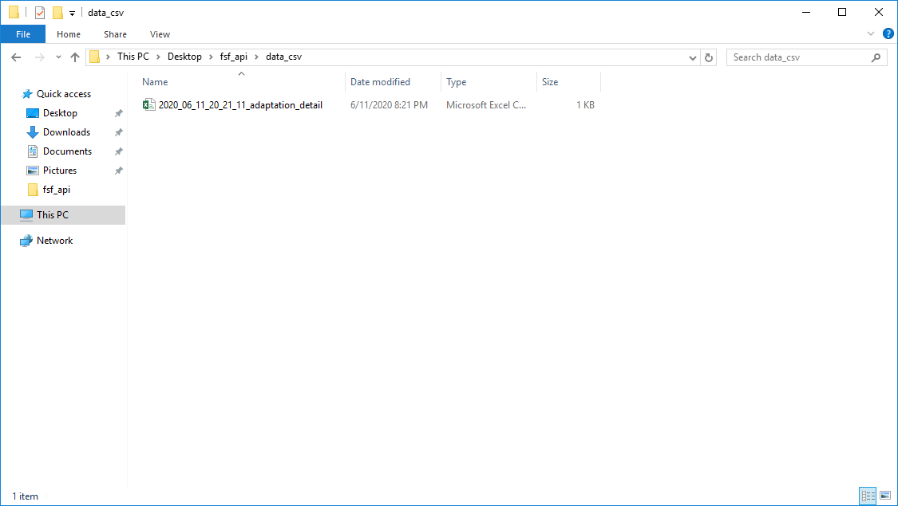


<a name="updating"></a>
# Updating the Project to the Newest Version:
If an update is made to this project, you will need to pull the changes from github and reinstall this project.

1. Open `git bash` and create then navigate to the existing project directory. Then navigate into the project directory, and run:

    ```git
    cd /path/to/project
   
    cd fsf_api_access_python/
   
    git pull
    ```

    If the response is `Already up to date.`, then you have the latest version of the project already.

    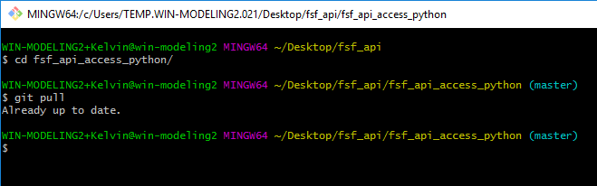

2. Open a new console, navigate to the project, and re-run the setup script to re-install the project:

    ```shell script
    cd /path/to/project
   
    .\venv\Scripts\activate
   
    pip install .\fsf_api_access_python\.
    ```

    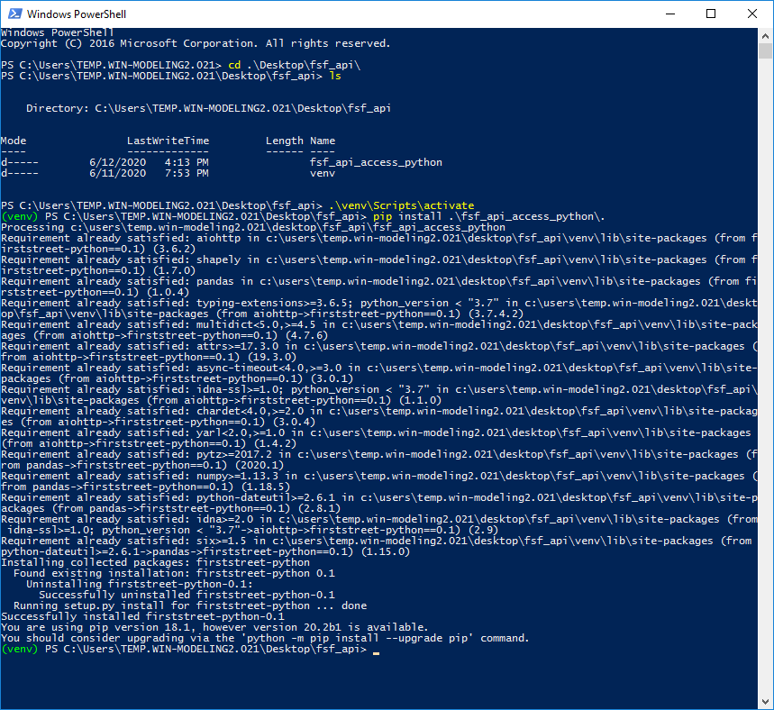

3. The project should now be updated to the newest version

<a name="license"></a>
# License
```  
MIT License

Copyright (c) 2020 First Street Foundation

Permission is hereby granted, free of charge, to any person obtaining a copy
of this software and associated documentation files (the "Software"), to deal
in the Software without restriction, including without limitation the rights
to use, copy, modify, merge, publish, distribute, sublicense, and/or sell
copies of the Software, and to permit persons to whom the Software is
furnished to do so, subject to the following conditions:

The above copyright notice and this permission notice shall be included in all
copies or substantial portions of the Software.

THE SOFTWARE IS PROVIDED "AS IS", WITHOUT WARRANTY OF ANY KIND, EXPRESS OR
IMPLIED, INCLUDING BUT NOT LIMITED TO THE WARRANTIES OF MERCHANTABILITY,
FITNESS FOR A PARTICULAR PURPOSE AND NONINFRINGEMENT. IN NO EVENT SHALL THE
AUTHORS OR COPYRIGHT HOLDERS BE LIABLE FOR ANY CLAIM, DAMAGES OR OTHER
LIABILITY, WHETHER IN AN ACTION OF CONTRACT, TORT OR OTHERWISE, ARISING FROM,
OUT OF OR IN CONNECTION WITH THE SOFTWARE OR THE USE OR OTHER DEALINGS IN THE
SOFTWARE.
```


[git]: <https://git-scm.com/downloads>
